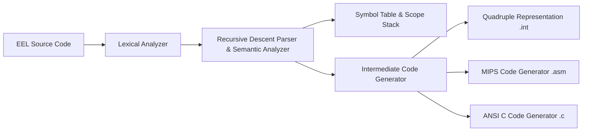

# EEL Compiler

[](https://github.com/ChristosGoulas/EEL-Compiler/actions/workflows/ci.yml)
[](https://www.python.org/)
[](LICENSE)

A single-pass compiler for **EEL** (Educational Imperative Language) written in Python. The compiler translates EEL source programs through a full compilation pipeline—from tokenization and recursive-descent parsing to intermediate quadruple three-address code, MIPS 32-bit assembly, and ANSI C debug output.

---

## Architecture & Compiler Pipeline



1. **Lexical Analysis (`tokenizer`)**: Character-level state machine recognizing keywords, identifiers, 16-bit signed integer constants, arithmetic/relational operators, and block/line comments.
2. **Syntax & Semantic Analysis**: Recursive-descent parser verifying grammar, lexical scope rules, subprogram signatures, pass-by-value (`in`) versus pass-by-reference (`inout`) parameters, and valid return/exit statements.
3. **Symbol Table & Frame Management**: Dynamic multi-level scope stack (`Scope`, `Entity`, `Variable`, `Parameter`, `Function`, `TempVar`) computing stack frame offsets (`$sp`/`$fp`) and static links for non-local variable access.
4. **Intermediate Representation**: Quadruple three-address code (`[qid, op, arg1, arg2, target]`) with list merging and backpatching for conditional jumps and boolean expressions.
5. **Code Emitters**:
   - **MIPS Assembly (`.asm`)**: Target MIPS assembly with stack frame management, procedure prologue/epilogue, register allocation (`$t0`–`$t2`, `$sp`, `$fp`, `$ra`), and syscall I/O.
   - **ANSI C (`.c`)**: Debugging pseudocode rendering control flow via labeled `goto`s and standard C constructs.

---

## Language Features

- **Program Units**: `program` ... `endprogram`
- **Declarations**: `declare x, y, z enddeclare`
- **Subprograms**:
  - `procedure proc(in x, inout y) ... endprocedure`
  - `function fn(in x) ... return expr; endfunction`
  - Static lexical scoping and arbitrary subprogram nesting
- **Parameter Passing**:
  - `in`: Call-by-value (`CV`)
  - `inout`: Call-by-reference (`REF`)
- **Control Flow**:
  - `if` ... `then` ... `else` ... `endif`
  - `while` ... `endwhile`
  - `repeat` ... `endrepeat` with `exit` (loop break)
  - `switch` ... `case` ... `endswitch`
  - `forcase` ... `when` ... `endforcase`
- **I/O Statements**: `input x`, `print expr`
- **Boolean Logic**: `and`, `or`, `not` with short-circuit evaluation

---

## Repository Structure

```
.
├── docs/                     # Formal language documentation
│   └── grammar.ebnf          # Formal EBNF grammar specification
├── eel_compiler/             # Core modular compiler package
│   ├── lexer.py              # Character-state machine tokenizer
│   ├── parser.py             # Recursive descent parser & semantic analyzer
│   ├── symbols.py            # Scope stack & symbol table entity classes
│   ├── ir.py                 # Quadruple IR & backpatching list manager
│   ├── optimizer.py          # Constant folding & dead code optimizer
│   ├── errors.py             # Compiler exception hierarchy
│   ├── tokens.py             # Token & TokenType definitions
│   ├── cli.py                # Command-line interface driver
│   └── codegen/              # Output code generators
│       ├── mips.py           # MIPS 32-bit assembly generator
│       └── c_emitter.py      # ANSI C debug pseudocode generator
├── compiler.py               # Standalone entry point wrapper script
├── pyproject.toml            # PEP 621 Python package configuration
├── examples/                 # Canonical EEL sample programs
│   ├── example1.eel          # Nested functions & procedure calls
│   ├── example2.eel          # Multi-level procedure nesting & pass-by-ref
│   └── example3.eel          # Nested loops & exit handling
├── tests/                    # Unit & integration test suite
│   ├── test_units.py         # Unit tests for Lexer, IR, Symbols & CLI
│   └── test_compiler.py      # End-to-end compilation & GCC validation
├── grammar_eel_1.png         # Grammar specification diagram (part 1)
├── grammar_eel_2.png         # Grammar specification diagram (part 2)
├── .github/workflows/ci.yml  # GitHub Actions CI pipeline
└── LICENSE                   # MIT License
```

---

## Quick Start

### Installation

Install as an editable Python package using `pip`:

```bash
pip install -e .
```

### Running the Compiler

You can compile an EEL program using the standalone wrapper or the installed CLI command:

```bash
# Direct execution via wrapper script
python3 compiler.py examples/example1.eel

# Or via installed CLI command
eel-compiler examples/example1.eel
# or shorthand alias
eelc examples/example1.eel

# Pass -v or --verbose to display quadruples and generated file paths
python3 compiler.py examples/example1.eel -v

# Pass -O or --optimize to enable constant folding and dead code elimination
python3 compiler.py examples/example1.eel -O -v
```

Compilation output is generated in `compiler_results/<filename>/`:

- `<filename>.int` — Intermediate quadruples
- `<filename>.asm` — Target MIPS assembly
- `<filename>.c`   — ANSI C pseudocode

### Python API Usage

You can also use the compiler programmatically within Python:

```python
from eel_compiler import compile_file, Lexer, Parser

# Compile a source file to quadruples, MIPS asm, and C
quads = compile_file("examples/example1.eel", output_dir="output/")

# Or tokenize source code directly
lexer = Lexer("program test declare x enddeclare x := 10 ; endprogram")
token = lexer.get_next_token()
```

### Running Tests

Execute the automated test suite:

```bash
python3 -m unittest discover tests -v
```

---

## Example Output

Given EEL source snippet:

```eel
program sample
    declare x, y enddeclare
    x := 10;
    y := x + 5;
    print y;
endprogram
```

The compiler produces intermediate quadruples:

```text
[1, 'begin_block', 'sample', ' ', ' ']
[2, ':=', '10', '', 'x']
[3, '+', 'x', '5', 'T_0']
[4, ':=', 'T_0', '', 'y']
[5, 'out', 'y', '', '']
[6, 'halt', ' ', ' ', ' ']
[7, 'end_block', 'sample', ' ', ' ']
```

---

## License

This project is open source and available under the [MIT License](LICENSE).